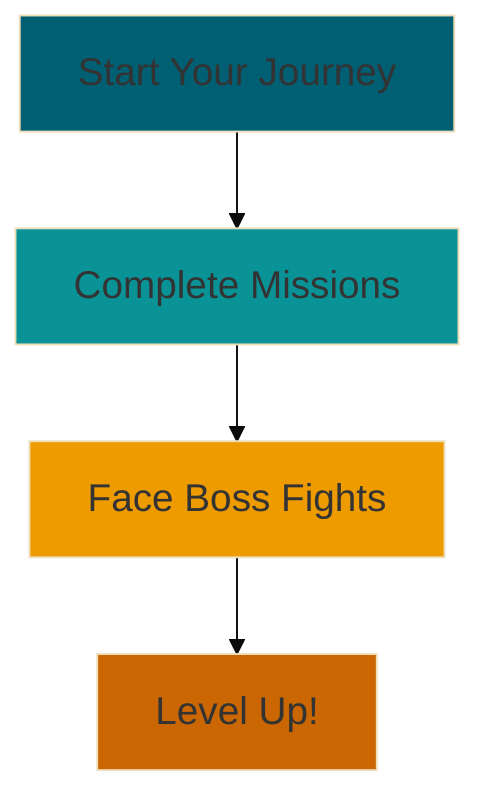

# Level 1: Getting Started with Python 🐍

Welcome, brave coder, to Level 1 of your Python adventure! 🎉 This is where your journey begins, and we're thrilled to
guide you through your first steps in the world of Python programming.

## What to Expect in Level 1

In this foundational level, we'll cover the essential building blocks that will set you up for success in your Python
journey. Here's a sneak peek at what's coming:

1. **Environment Setup**: We'll get your coding workspace ready for action.
2. **Python Built-ins**: Discover the powerful tools Python provides out of the box.
3. **First Python Program**: Experience the thrill of running your very first Python code!
4. **Basic Syntax and Variables**: Learn the grammar of Python.
5. **Operators and Expressions**: Explore how to perform operations in Python.
6. **String Operations and Methods**: Harness the power of text manipulation.
7. **Input and Output**: Interact with your programs.
8. **Control Structures**: Make your code dynamic with decision-making and loops.

## Your Quest

Your mission, should you choose to accept it, is to complete each section of this level. Along the way, you'll face
challenges that will test your understanding and skills. But fear not! With each challenge conquered, you'll grow
stronger and more confident in your Python abilities.

## Boss Fights Ahead!

At the end of this level, you'll face three epic boss fights:

1. **The Environment Architect**: Set up a full Python development environment.
2. **The Calculator Creator**: Build a functioning calculator program.
3. **The Number Oracle**: Develop an interactive number guessing game.

These challenges will put everything you've learned to the test. Are you ready to prove your Python prowess?

## Words of Encouragement

Remember, every expert was once a beginner. Take your time, enjoy the process, and don't be afraid to make mistakes –
they're the best teachers!

Are you ready to embark on this exciting adventure? Let's dive into our first mission: Environment Setup!

> "The secret of getting ahead is getting started."
> – Mark Twain

Now, onward to your first mission, brave Python adventurer! 🐍✨
