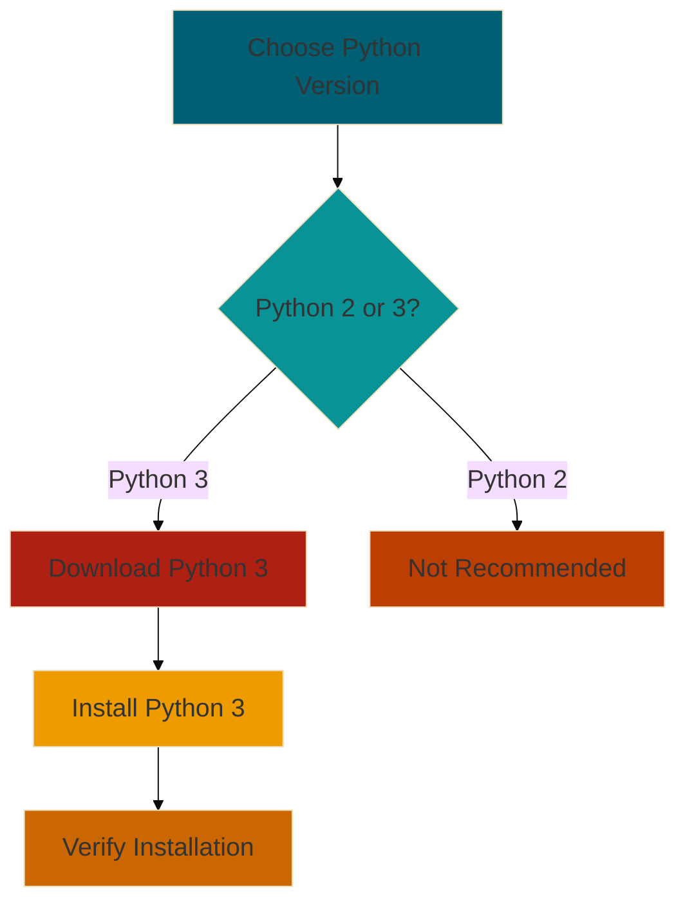

# Installing Python 🐍

Welcome to your first step in the Python journey! Installing Python is like acquiring your first spell in a magical
adventure. Let's get Python set up on your system.

## Objectives

By the end of this section, you will:

1. Download the correct Python version for your operating system
2. Install Python on your computer
3. Verify your Python installation
4. Understand the difference between Python 2 and Python 3

## Choosing Your Python Version



> I strongly recommend using Python 3, as Python 2 reached its end of life on January 1, 2020.
> {style="warning"}

## Installation Steps

### For Windows:

1. Visit the official Python website: www.python.org
2. Click on the **"Download Python 3.x.x"** button
3. Run the installer
4. Important: Check the box that says "Add Python 3.x to PATH"
5. Click **"Install Now"**

### For macOS:

1. Visit the official Python website: www.python.org
2. Click on the **"Download Python 3.x.x"** button
3. Run the installer package
4. Follow the installation wizard

### For Linux:

Most Linux distributions come with Python pre-installed. To check, open a terminal and type:

```Shell
python3 --version
```

If you need to install Python:

```Shell
# For Ubuntu or Debian:
sudo apt-get update
sudo apt-get install python3

# For Fedora:
sudo dnf install python3
```

### Verifying Your Installation

After installation, let's make sure Python is correctly installed:

1. Open a command prompt (Windows) or terminal (macOS/Linux)
2. Type the following command and press Enter:

```Shell
python3 --version
```

You should see output similar to:

```text
Python 3.x.x
```

## Python 2 vs Python 3

While Python 2 and 3 share many similarities, Python 3 introduced several improvements:

* Better Unicode support
* Print is a function, not a statement
* Integer division returns a float
* Many standard library improvements

> Remember: Always use Python 3 for new projects. Python 2 is no longer supported.
> {style="tip"}

> "The journey of a thousand miles begins with one step." - Lao Tzu

Congratulations! By installing Python, you've taken that crucial first step. You now have the basic tool needed to start
your Python programming journey.

## Ready for the Next Step?

Now that you have Python installed, it's time to set up your development environment. In the next section, we'll explore
different code editors and IDEs to make your Python coding experience even better!

> Challenge: Try running your first Python command! Open a Python interactive shell by typing python in your command
> line, then try a simple command like print("Hello, Python!").
> {style="tip"}
