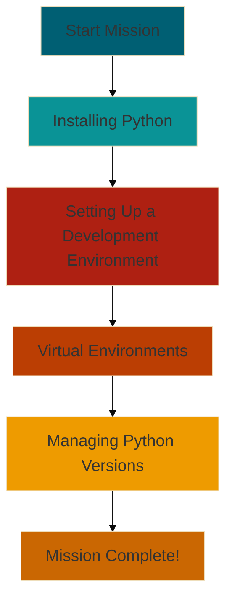

# Mission 1: Environment Setup 🛠️

Welcome, intrepid Python explorer! Your first mission is to prepare your coding workspace. Just as a chef needs a
well-equipped kitchen, a Python developer needs a properly set up environment. Let's get you ready for the coding
adventures ahead!

## Your Objectives

In this mission, you'll:

1. Install Python on your system
2. Set up a code editor or Integrated Development Environment (IDE)
3. Learn about virtual environments
4. Explore managing different Python versions

## Why This Matters

A well-configured environment will:

- Make your coding process smoother
- Help you avoid common pitfalls
- Allow you to manage projects more effectively
- Prepare you for real-world development scenarios

## Your Path Through This Mission

## What You'll Learn

1. **Installing Python:** You'll download and install the latest version of Python on your system.
2. **Setting Up a Development Environment:** We'll guide you through choosing and setting up a code editor or IDE.
3. **Virtual Environments:** You'll learn how to create isolated environments for your Python projects.
4. **Managing Python Versions:** We'll introduce you to tools for managing multiple Python versions on your system.

> "The secret of getting ahead is getting started." - Mark Twain

Setting up your environment might seem daunting at first, but it's the crucial first step in your Python journey. Take
it one step at a time, and soon you'll have a powerful workspace at your fingertips!

## Ready to Begin?

Your journey into the world of Python starts here. In the following pages, we'll dive deep into each aspect of setting
up your environment.

> Tip: Don't rush through the setup process. Take your time to understand each component. A solid foundation will make
> your future coding much easier!
> {style="tip"}

Are you ready to set up your Python workshop? Let's dive into our first subtopic: **Installing Python!**