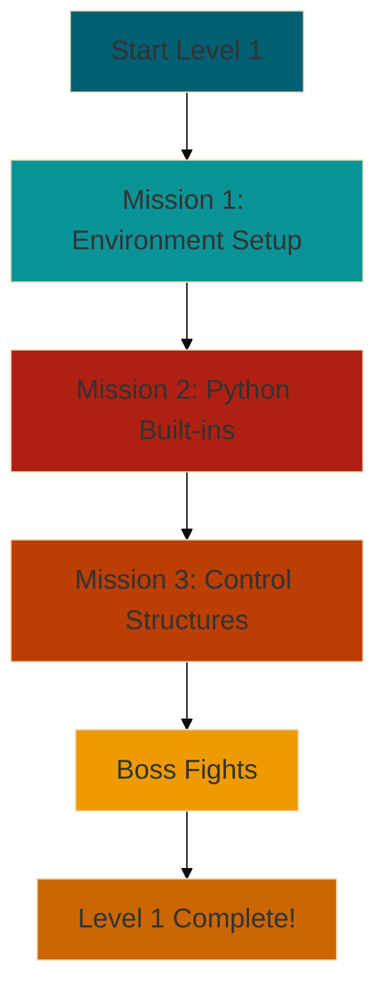

# Overview: Your Python Quest Begins 🗺️

Welcome to the grand overview of Level 1 in your Python adventure! Here, we'll map out the exciting journey ahead and
prepare you for the challenges you'll face.

## Your Path to Python Mastery

In Level 1, you'll embark on three main missions, each designed to build your foundational Python skills:

### Mission 1: Environment Setup 🛠️

- Installing Python
- Setting Up a Development Environment
- Virtual Environments
- Managing Python Versions with pyenv

### Mission 2: Python Built-ins 🧰

- Built-in Functions
- Built-in Data Types
- Built-in Constants
- Built-in Exceptions
- Magic Methods and Operator Overloading

### Mission 3: Control Structures 🔀

- Conditional Statements
- Loops
- Comprehensions
- Error Handling Basics

## Skills You'll Gain

By the end of Level 1, you'll be equipped with these essential Python skills:

1. **Environment Mastery**: Set up and manage Python environments like a pro.
2. **Code Creation**: Write and run your first Python programs.
3. **Data Manipulation**: Work with various data types and perform operations.
4. **Program Flow**: Control the flow of your programs with conditions and loops.
5. **Error Management**: Handle errors gracefully in your code.

## Your Adventure Map

Here's a visual representation of your journey through Level 1:

## Prepare for Battle: Boss Fights
At the conclusion of Level 1, you'll face these challenging boss fights:

1. **The Environment Architect:** Create a robust Python development setup.
2. **The Pythonic Toolsmith:** Craft solutions using Python's built-in tools.
3. **The Flow Master:** Demonstrate your command over program flow and error handling.

These boss fights will put your newly acquired skills to the test, solidifying your understanding and preparing you for
the challenges ahead.

> "The expert in anything was once a beginner." 
> - Helen Hayes

Every Python master started exactly where you are now. Embrace the challenges, celebrate your victories (no matter how
small), and most importantly, enjoy the learning process!

## Ready to Begin?
With this roadmap in hand, you're all set to start your Python adventure. Your first mission awaits: Environment Setup.
Are you ready to take the first step towards becoming a Python master?

> Keep a "victory journal" to track your progress. Write down what you learn each day, no matter how small. It's a
> great way to see how far you've come!
> {style="tip"}

Onward to your first mission, brave coder! The world of Python awaits your exploration. 🐍🌟
